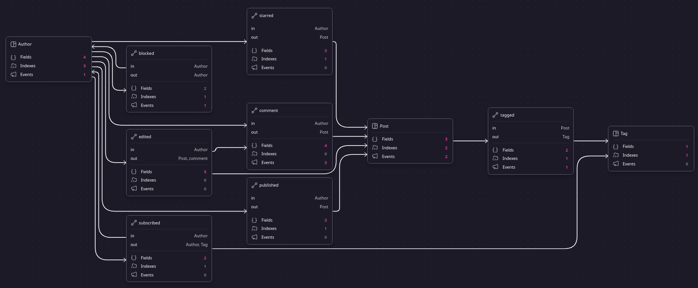

# Posta

A lightweight social backend API built with
[SurrealDB](https://github.com/surrealdb/surrealdb) for authors to manage
their content.

## Features

This project provides a simple yet powerful platform for users to:

- **Author Management**: Secure sign-up and login functionality for new authors
- **Subscriptions**: Curate your own feed by subscribing to your favorite authors
- **Comments**: Create and edit comments and control who can comment on your own posts
- **Post Management**: Create, edit, and delete own posts
- **Starring System**: Like or star other authors' posts to show support and engagement
- **Full Text Search**: Powerful text searching through all posts

## Design

Schema graph:  


## Usage  

Here are a handful of code snippets and usages.


#### New user  

```bash
curl -X POST -H "Accept: application/json" -d '{
    "ns":"posta",
    "db":"posta",
    "ac":"Author",
    "user":"john.doe",
    "email_address":"john.doe@example.com",
    "pass":"123456"
}' http://localhost:8000/signup
```
[`User Signup`](https://surrealdb.com/docs/surrealdb/integration/http#signup)  


Implementation within `Posta`:
```surql
DEFINE ACCESS Author ON DATABASE TYPE RECORD
    SIGNIN (
        SELECT * FROM Author WHERE email IS $email AND crypto::argon2::compare(pass, $pass)
    )
    SIGNUP (
        CREATE Author CONTENT {
            name: $name,
            email_address: $email_address,
            pass: crypto::argon2::generate($pass),
        }
    );
```
[`ACCESS`](https://surrealdb.com/docs/surrealql/statements/define/access)  


#### New Post  

Using a built-in function to make a new post
```surql
fn::Post::new($body, $title, $tags)
```

Function definition in schema:
```surql
DEFINE FUNCTION fn::Post::new($body: string, $title: string, $tags: array<string>) -> object {
    LET $post = CREATE ONLY Post CONTENT {
        body: $body,
        title: $title,
    } RETURN AFTER;

    FOR $tag IN $tags {
        LET $tag = string::lowercase($tag);
        -- Make new `Tag` if `$tag` doesn't exist
        IF (array::is_empty(SELECT * FROM Tag WHERE tag IS $tag)) {
            CREATE ONLY Tag CONTENT { tag: $tag };
        };

        LET $post_id = $post.id;
        LET $tag_id = (SELECT id FROM Tag WHERE tag IS $tag);

        RELATE $post_id->tagged->$tag_id;
    };

    RETURN $post;
} PERMISSIONS FULL;
```
[`FUNCTION`](https://surrealdb.com/docs/surrealql/statements/define/function)


#### Edit Post  

```surql
UPDATE $post_id MERGE {body: $body}
```

`EVENT` that checks for authorization and creates a `diff` object when a post is edited.
```surql
DEFINE EVENT post_edited ON TABLE Post WHEN $event IS "UPDATE" THEN {
    IF array::is_empty(SELECT id FROM published WHERE in IS $auth.id AND out IS $value.id) {
        THROW "Cannot edit unowned resource";
    };

    RELATE ($auth.id)->edited->($value.id) CONTENT {
        diff_ops: value::diff($before, $after)
    };
};
```


#### New Comment  

Using `SurrealQL` to make a comment
```surql
RELATE ($auth.id)->comment->$post CONTENT { message: $message }
```


#### Text Search

Searching titles
```surql
SELECT * FROM Post WHERE title @@ 'SurrealDB';
```  

Rank-searching for Post content
```surql
SELECT search::score(1) AS score FROM Post
    WHERE body @1@ 'graph-based database'
    ORDER BY score DESC;
```
[Search functions](https://surrealdb.com/docs/surrealql/functions/database/search)
